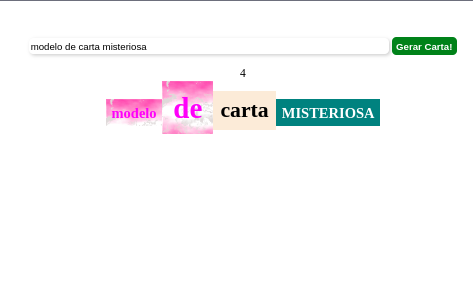

# Carta Misteriosa



# Índice

* [Título e Imagens Home](#carta-misteriosa)
* [Tecnologias utilizadas](#tecnologias-utilizadas)
* [Descrição do projeto](#descrição-do-projeto)
* [Status do Projeto](#status-do-projeto)
* [Funcionalidade do projeto](#-funcionalidade-do-projeto)
* [Acesso ao Projeto](#acesso-ao-projeto)

# Tecnologias utilizadas


# Descrição do Projeto

O projeto "Carta Misteriosa" é parte do currículo da formação de Desenvolvedor Web da [Trybe](https://www.betrybe.com/). Nesse projeto, os alunos têm a oportunidade de aplicar seus conhecimentos em HTML, CSS e JavaScript para criar um jogo de carta misteriosa.

# Status do Projeto

> 💹 Alpha 💹

# Funcionalidade do projeto

- Jogo de carta misteriosa.

# Acesso ao projeto

Para acessar e executar este projeto, siga os passos abaixo:

1. Certifique-se de ter o Node.js e o npm instalados em sua máquina.

2. Clone o Projeto

```bash
git clone https://github.com/EversonDias/Carta_Misteriosa_with_HTML_CSS_and_JavaScript.git CartaMisteriosa
```

3. Entre no projeto

```bash
cd CartaMisteriosa
```

4. inicie o projeto

```bash
npm start
```
